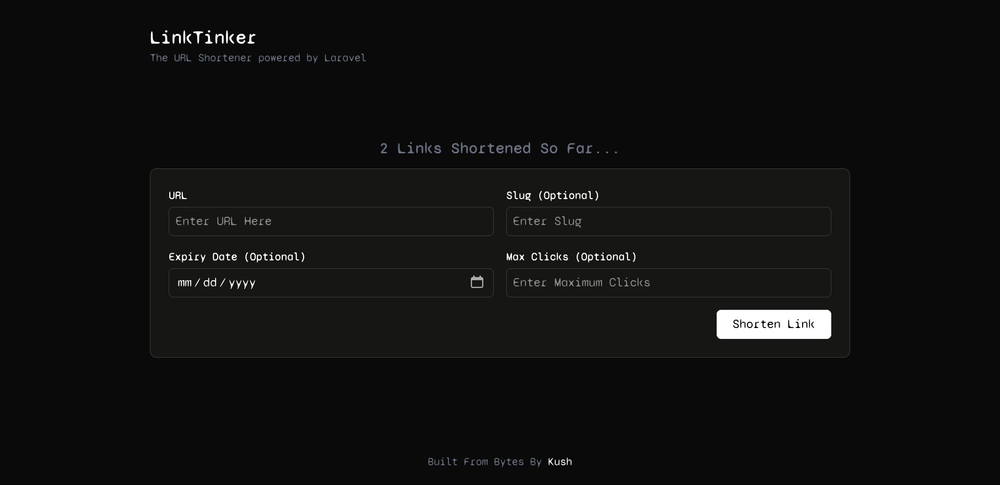
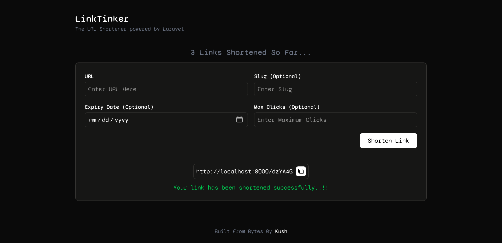

# LinkTinker

> A modern, feature-rich URL shortener built with Laravel that allows you to create short, memorable links with optional expiration dates and click limits.

## Table of Contents

- [Overview](#overview)
- [Features](#features)
- [Screenshots](#screenshots)
- [Tech Stack](#tech-stack)
- [Installation](#installation)
- [Environment Variables](#environment-variables)
- [Usage](#usage)
- [Database Schema](#database-schema)

## Overview

LinkTinker is a powerful URL shortener that helps you create short, shareable links. It's built with Laravel and comes with features like custom slugs, link expiration, and click tracking. Whether you're sharing links on social media, in emails, or anywhere else, LinkTinker makes your links more manageable and trackable.

## Features

- **URL Shortening**: Convert long URLs into short, shareable links
- **Custom Slugs**: Option to set custom short URLs (e.g., yourdomain.com/myslug)
- **Link Expiration**: Set expiration dates for your shortened links
- **Click Limits**: Restrict the number of times a link can be accessed
- **Click Tracking**: Monitor how many times each link has been clicked
- **Responsive Design**: Works on desktop and mobile devices
- **Copy to Clipboard**: One-click copy of shortened URLs
- **Automatic Cleanup**: Expired and maxed-out links are automatically deactivated

## Screenshots



*The clean and intuitive interface for creating short links*


## Tech Stack

- **Backend**: Laravel 10.x
- **Frontend**: Blade Templates, Tailwind CSS
- **Database**: MySQL/PostgreSQL/SQLite
- **JavaScript**: Vanilla JS for interactivity
- **Deployment**: Compatible with any PHP 8.1+ server

## Installation

1. **Clone the repository**
   ```bash
   git clone https://github.com/yourusername/LinkTinker.git
   cd LinkTinker
   ```

2. **Install PHP dependencies**
   ```bash
   composer install
   ```

3. **Install NPM dependencies**
   ```bash
   npm install
   npm run build
   ```

4. **Create and configure .env file**
   ```bash
   cp .env.example .env
   php artisan key:generate
   ```

5. **Configure your database**
   Update the `.env` file with your database credentials:
   ```
   DB_CONNECTION=mysql
   DB_HOST=127.0.0.1
   DB_PORT=3306
   DB_DATABASE=linktinker
   DB_USERNAME=your_username
   DB_PASSWORD=your_password
   ```

6. **Run migrations**
   ```bash
   php artisan migrate
   ```

7. **Start the development server**
   ```bash
   php artisan serve
   ```

8. **Access the application**
   Open your browser and visit: `http://localhost:8000`

## Environment Variables

Create a `.env` file in the root directory and configure the following variables:

```
APP_NAME=LinkTinker
APP_ENV=local
APP_KEY=your_application_key
APP_DEBUG=true
APP_URL=http://localhost:8000

DB_CONNECTION=mysql
DB_HOST=127.0.0.1
DB_PORT=3306
DB_DATABASE=linktinker
DB_USERNAME=root
DB_PASSWORD=

# Optional: Set to true to force HTTPS URLs
FORCE_HTTPS=false

# Optional: Set your application timezone
timezone=UTC

# Optional: Configure mail settings if you want to enable email notifications
MAIL_MAILER=smtp
MAIL_HOST=mailhog
MAIL_PORT=1025
MAIL_USERNAME=null
MAIL_PASSWORD=null
MAIL_ENCRYPTION=null
MAIL_FROM_ADDRESS="hello@example.com"
MAIL_FROM_NAME="${APP_NAME}"
```

## Usage

1. **Creating a Short Link**
   - Visit the homepage
   - Enter your long URL
   - (Optional) Set a custom slug
   - (Optional) Set an expiration date
   - (Optional) Set a maximum number of clicks
   - Click "Shorten Link"
   - Copy your shortened URL

2. **Accessing a Short Link**
   - Simply visit the shortened URL
   - You'll be automatically redirected to the original URL

3. **Link Expiration**
   - If an expiration date is set, the link will stop working after that date
   - If a click limit is set, the link will stop working after reaching the maximum number of clicks

## Database Schema

### short_links Table

| Column | Type | Description |
|--------|------|-------------|
| id | bigint | Primary key |
| slug | string | The short URL identifier |
| url | string | The original URL |
| clicks | integer | Number of times the link has been clicked |
| max_clicks | integer | Maximum allowed clicks (null for unlimited) |
| expires_at | timestamp | Expiration date (null for never) |
| deleted_at | timestamp | For soft deletes |
| created_at | timestamp | When the link was created |
| updated_at | timestamp | When the link was last updated |

---

Built from `bytes` by [Kush](https://github.com/Kush-4826)
